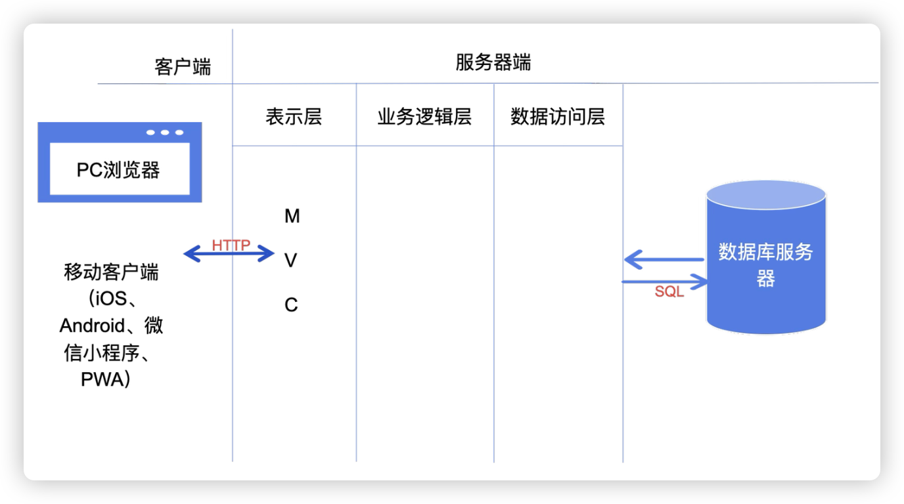

# nestJs
BFF: 
1.解决微服务架构客户端复杂性，客户端需要调多个接口才能展示，在客户端和服务端之间插入一层BFF聚合接口
2.适配多端需求，如H5，小程序，PC端等
3.提高开发效率和灵活性，减少沟通成本，前端可以直接维护BFF层
4.安全性增强，在BFF直接统一处理
5.其他业务层处理

## 三层架构与MVC
### 三层架构
1. **表示层（Presentation Layer）**
   - 负责与用户交互，展示数据并接收用户输入。
   - 通常包括用户界面（UI）和用户交互逻辑。
2. **业务逻辑层（Business Logic Layer）**
   - 负责处理核心业务逻辑，执行具体的业务规则。
   - 将表示层的输入转化为对数据的操作，并将处理结果返回给表示层。
   - 该层的主要职责是保证数据的完整性和一致性。
3. **数据访问层（Data Access Layer）**
   - 负责与数据库进行交互，执行 CRUD 操作（创建、读取、更新和删除）。
   - 提供对数据存储和访问的抽象接口，屏蔽数据库的具体实现细节。

**Entity(实体层)：**它不属于三层中的任何一层，但是它是必不可少的一层，每一层（UI—>BLL—>DAL）之间的数据传递（单向）是靠变量或实体作为参数来传递的，这样就构造了三层之间的联系，完成了功能的实现

### MVC
1. 模型（Model）
   - 负责处理数据和业务逻辑。
2. 视图（View）
   - 负责展示数据和用户界面。
3. 控制器（Controller）
   - 负责接收用户请求，调用模型处理数据，更新视图。
虽然**三层架构**和**MVC**在概念上有类似之处，都会将系统划分为不同的部分以实现职责分离，但它们的**关注点**、**应用范围**和**目的**是不同的。你会觉得它们相似，是因为它们都强调分层和职责分离，但它们的**层次划分和关注点不一样**。


## Loc核心
首先，你需要先理解上节课的三层架构和MVC，正是由于三层架构和MVC的出现，在后端体系中，通常包含下面几个组成部分
- **Controller（控制器）**：负责接受客户端的请求和响应返回
- **Service（服务）**：处理业务逻辑
- **Dao（数据访问对象）**或 **Repository（仓库）**：负责对数据执行增删改查（CRUD）操作
- **DataSource（数据源）**：根据配置信息连接和管理数据库
这意味着，在后端的开发过程中，你需要按照合适的顺序创建这些内容。比如下面的伪代码：
```typescript
const dataSource = new DataSource(config);
const dao = new Dao(dataSource);
const service = new Service(dao);
const controller = new Controller(service);
```
在大型应用中，手动管理这种依赖关系，会变得非常复杂和繁琐。所以，**IoC（Inverse of Control，控制反转）**就提供了这么一种解决方案：
**通过IoC，我们从主动创建和维护对象，转变为了被动等待依赖注入，实现了从主动下厨到等待服务员上菜的转变，这就是IoC控制反转的精髓**

## nest中Loc
```js
1.@Controller('user')
标记这是一个控制器 Controller，负责接收 HTTP 请求，处理路由。
2.@Injectable()
标记这是一个可注入提供者 Provider（Service、工具类、拦截器、守卫等都要加），负责业务逻辑、数据处理，被控制器 / 其他服务注入使用。
3.@Inject('AppService')
标记这是一个依赖注入的属性，负责从容器中获取依赖的实例。
```

## 装饰器
在Nest中实现了前4种装饰器：
- 类装饰器：@Controller、@Injectable、@Module、@UseInterceptors
- 方法装饰器：@Get、@Post、@Patch、@Delete、@UseInterceptors
- 属性装饰器：@IsNotEmpty、@IsString、@IsNumber
- 参数装饰器：@Body、@Param、@Query，@Header，@Req，@Res

## 自定义装饰器
我们可以通过自定义装饰器获取请求中的特定属性：

```typescript
import {
  createParamDecorator,
  ExecutionContext,
  SetMetadata,
} from '@nestjs/common';

export const SetUser = (...args: string[]) => SetMetadata('SetUser', args);

export const GetUser = createParamDecorator(
  (data: string, ctx: ExecutionContext) => {
    return 'jack';
  },
);
```

在Controller中简单处理一下：

```typescript
@Get('hello2')
getHello2(@GetUser() u: string): string {
  console.log(u);
  return this.appService.getHello();
}
```
### 自定义的`MyHeaders`

```typescript
export const MyHeaders = createParamDecorator(
  (data: string, ctx: ExecutionContext) => {
    const request: Request = ctx.switchToHttp().getRequest();
    return data ? request.headers[data.toLowerCase()] : request.headers;
  },
);
```
Controller中使用和`@Headers`用法一模一样

```typescript
@Get('hello3')
getHello3(@Headers('host') header1, @MyHeaders('host') header2): string {
  console.log(header1);
  console.log(header2);
  return this.appService.getHello();
}
```
### 自定义`MyQuery`

```typescript
export const MyQuery = createParamDecorator(
  (data: string, ctx: ExecutionContext) => {
    const request: Request = ctx.switchToHttp().getRequest();
    return request.query[data];
  },
);
```

Controller中使用和`@Query`用法一模一样

```typescript
@Get('hello4')
getHello4(
  @Query('username') username: string,
  @MyQuery('age') age: number,
): string {
  console.log(username);
  console.log(age);
  return this.appService.getHello();
}
```


## 模块
在Nest中，模块通过@Module装饰器来声明。每个应用都会有一个根模块，Nest框架会从根模块开始收集各个模块之间的依赖关系，形成依赖关系树。在应用初始化时，根据依赖关系树实例化不同的模块对象。
在模块树中，每个模块都有自己独立的作用域，他们之间的代码是相互隔离的，各自拥有自己的控制器(Controllers)、服务提供者(Providers)、中间件(Middlerwares)和其他组件。
```js
// 共享模块
@Module({
  controllers: [UserController],
  providers: [UserService],
  // 导出 UserService，以便其他模块可以使用
  exports: [UserService],
})
export class UserModule {}

// 声明为全局模块
@Global()
@Module({
  controllers: [UserController],
  providers: [UserService],
  exports: [UserService],
})
export class UserModule {}

// 动态模块
// 通过命令行创建 nest g res auth --no-spec
@Module({
  controllers: [AuthController],
  providers: [AuthService],
})
export class AuthModule {}

// Dynamic Module
import { DynamicModule, Module } from '@nestjs/common';
import { AuthService } from './auth.service';
import { AuthController } from './auth.controller';

@Module({})
export class AuthModule {
  static register(options: Record<string, any>): DynamicModule {
    return {
      module: AuthModule,
      controllers: [AuthController],
      providers: [
        {
          provide: 'CONFIG_OPTIONS',
          useValue: options,
        },
        AuthService,
      ],
      exports: [],
    };
  }
}

// 动态模块的使用
@Module({
  imports: [
    ......
    AuthModule.register({
      role: 'admin',
      type: 'auth',
    }),
  ],
  controllers: [AppController],
  providers: [AppService],
})
export class AppModule {}

这里的 register 方法其实并不是固定的，但 nest 约定了 3 种方法名：
- register
- forRoot
- forFeature
```

## Aop
以一个HTTP请求为例，客户端发送请求时会经过Controller（控制器），Service（服务）、DB（数据访问或操作）等模块，如果想要在这些模块中加入一些操作，例如数据验证、权限校验或者日志统计等等，就可以使用Aop来统一管理。在Controller层的前后，都可以**“切一刀”**，用来统一处理公共逻辑，这样，就不会侵入Controller、Service等业务代码。

事实上，在Nest中，请求流程可以换一种角度来看：Middleware（中间件）、Guard（守卫）、Interceptor（拦截器）、Pipe（管道）和Filter（过滤器）。他们都是AOP思想的具体实现
### 中间件
**中间件**可以在**路由处理程序之前**或者**之后插入**需要执行的任务，Nest做了进一步细分，主要分为**全局中间件**和**局部中间件**件
```js
import { Inject, Injectable, NestMiddleware } from '@nestjs/common';
import { Request, Response, NextFunction } from 'express';
import { UserService } from 'src/user/user.service';
import { PersonService } from './person.service';
@Injectable()
export class PersonMiddleware implements NestMiddleware {
  @Inject(PersonService)
  private personService: PersonService;

  use(req: Request, res: Response, next: NextFunction) {
    console.log('before 中间件 ---' + req.url);
    console.log('调用注入的服务 ---' + this.personService.findAll());
    next();
    console.log('after 中间件 ---' + res.statusCode);
  }
}
```
### 守卫
路由守卫，可以用于在调用某个 Controller 之前判断权限，返回 **true** 或者 **false** 来决定是否放行
```js
import { CanActivate, ExecutionContext, Injectable } from '@nestjs/common';
import { Observable } from 'rxjs';
@Injectable()
export class PersonGuard implements CanActivate {
  canActivate(
    context: ExecutionContext,
  ): boolean | Promise<boolean> | Observable<boolean> {
    console.log('person guard');
    return true;
  }
}
```
### 拦截器
拦截器不同于中间件和守卫，它在路由请求之前和之后都可以进行逻辑处理，能够充分操作`request`和`response`对象。拦截器通常用于记录请求日志、转换或者格式化相应数据等等
拦截器通过`@Injectable()`来声明，并且需要实现`NestInterceptor`接口的`intercept`方法，接收两个参数：`ExecutionContext`上下文对象和`CallHandler`处理程序
类似于守卫，拦截器可以设置为**作用于某个控制器**，或者**某个控制器的某个方法**，当然，也能**作用于整个应用中**
```js
import {
  CallHandler,
  ExecutionContext,
  Injectable,
  NestInterceptor,
} from '@nestjs/common';
import { Observable } from 'rxjs';

@Injectable()
export class TimeoutInterceptor implements NestInterceptor {
  intercept(context: ExecutionContext, next: CallHandler): Observable<any> {
    console.log('进入拦截器');
    return next.handle()
  }
}
```
### Rxjs
**[RxJS](https://rxjs.dev/)**是一个用于处理异步数据流的JavaScript·库。你可以把它理解为一个管道，它可以帮你更方便的处理各种事件和数据流，当然我们没必要增加心智负担，可以更直白的认为它就是和前端的`Lodash`工具库差不多的一个库。

### 管道
Pipe 就是管道的意思，主要的作用就是解析和验证请求数据。
```js
用 nest cli 命令创建一个pipe，`nest g pipe validate --no-spec --flat`
import {
  ArgumentMetadata,
  BadRequestException,
  Injectable,
  PipeTransform,
} from '@nestjs/common';
@Injectable()
export class ValidatePipe implements PipeTransform {
  transform(value: any, metadata: ArgumentMetadata) {
    if (Number.isNaN(parseInt(value))) {
      throw new BadRequestException(`参数${metadata.data}错误`);
    }

    return typeof value === 'number' ? value : parseInt(value);
  }
}
// controller中
@Delete(':id')
remove(@Param('id', ValidatePipe) id: string) {
  console.log('person delete ---' + id)
  return this.personService.remove(+id);
}
```
当然，像这种比较简单的管道验证，nestjs已经帮我们内置了[9种开箱即用的管道验证器](https://docs.nestjs.com/pipes#built-in-pipes)：
- `ValidationPipe`
- `ParseIntPipe`
- `ParseFloatPipe`
- `ParseBoolPipe`
- `ParseArrayPipe`
- `ParseUUIDPipe`
- `ParseEnumPipe`
- `DefaultValuePipe`
- `ParseFilePipe`
- `ParseDatePipe`

### 过滤器
nest中最常见的是HTTP异常过滤器，通常用于在后端服务发生异常时向客户端报告异常的类型，目前[内置的HTTP异常](https://docs.nestjs.com/exception-filters#built-in-http-exceptions)包括下面几种，它们全部也都包含在`@nestjs/common`包中：
